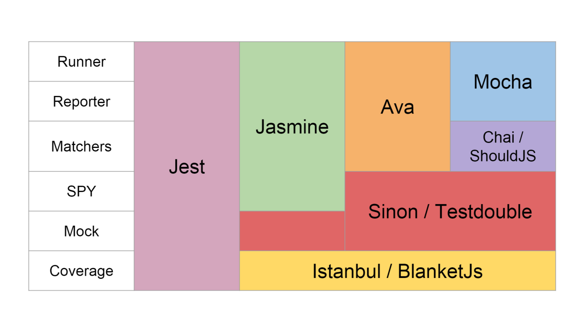

# Завантаження файлів

HTML форма, надіслана на сервер браузером, повинна бути закодована.  
Якщо ми не вказуємо метод кодування, то за замовчуванням використовується
`application/x-www-form-urlencoded`.  
Для надсилання файлів потрібно застосовувати тип кодування
`multipart/form-data`.  
Пакети для завантаження файлів на сервер:
[Multer](https://github.com/expressjs/multer) та
[Formidable](https://github.com/node-formidable/formidable).

[FormData (документація)](https://developer.mozilla.org/en-US/docs/Web/API/FormData/FormData#prepopulating_from_a_html_form_element)

## Multer

Multer — це проміжне ПЗ (middleware) фреймворка Express, яка використовується
при завантаженні файлів для обробки `multipart/form-data`. По суті є обгорткою
над низькорівневим пакетом [busboy](https://github.com/mscdex/busboy), що
дозволяє використовувати його максимально ефективно.

```shell
npm install -S multer
```

Multer додає об'єкт body та об'єкт file (або files) всередину об'єкта request.
Об'єкт body містить значення текстових полів форми, об'єкт file (files) містить
файл або файли, що завантажуються через форму.

Пакет надає наступну інформацію щодо кожного завантажуваного файлу:

| Ключ                  | Опис                                          |    Коментарі    |
| :-------------------- | :-------------------------------------------- | :-------------: |
| `fieldname`           | Field name specified in the form              |        —        |
| `originalname`        | Name of the file on the user's computer       |        —        |
| `encoding`            | Encoding type of the file                     |        —        |
| `mimetype`            | Mime type of the file                         |        —        |
| `size`                | Size of the file in bytes                     |        —        |
| `destination or dest` | The folder to which the file has been saved   |  `DiskStorage`  |
| `filename`            | The name of the file within the `destination` |  `DiskStorage`  |
| `path`                | The full path to the uploaded file            |  `DiskStorage`  |
| `buffer`              | A `Buffer` of the entire file                 | `MemoryStorage` |

Створення об'єкту налаштувань DiskStorage:

```js
//middlewares/upload.js
const multer = require("multer");
const path = require("path");

const tempDir = path.join(__dirname, "../", "tmp");

const multerConfig = multer.diskStorage({
  // шлях до тимчасової папки, де зберігатимуться файли
  destination: (req, file, cb) => {
    cb(null, tempDir);
  },
  filename: (req, file, cb) => {
    // file.originalname - зберігання файлу під тим ім'ям, яке нам прийшло
    cb(null, file.originalname);
  },
  // limits - встановлює максимальний розмір файлу в 1 Мбайт
  limits: {
    fileSize: 1048576,
  },
});
```

Створення екземпляру multer:

```js
const upload = multer({
  storage: multerConfig,
});
```

Використання проміжного ПЗ:

```js
// якщо ми очікуємо в полі picture один файл, а всі інші поля будуть текстовими
upload.single("picture");
// якщо ми очікуємо в полі picture кілька файлів (max - 7), а всі інші поля будуть текстовими
upload.array("picture", 7);
// якщо ми очікуємо в різних полях файли
upload.fields([
  { name: "cover", maxCount: 1 },
  { name: "subcover", maxCount: 2 },
]);
```

```js
app.post("/api/books", upload.single("cover"), async (req, res) => {
  console.log(req.body);
  console.log(req.file);
  //...controller uploadBook
});
```

> Веб-сервери за замовчуванням файли не повертають, щоб це виправити, потрібно
> написати окрему middleware:
>
> ```js
> // запис означає, що якщо прийде запит на статичний файл - >треба його шукати в папці public
> app.use(express.static("public"));
> ```

### Тимчасова аватарка (заглушка)

Для використання тимчасової аватарки можна використати:  
[Gravatar](https://ru.gravatar.com/) 👉
[npm-пакет](https://www.npmjs.com/package/gravatar)

```shell
npm i gravatar
```

```js
const gravatar = require("gravatar");
const avatarURL = gravatar.url(email);
```

### JavaScript Image Manipulation Program (Jimp)

[Jimp](https://www.npmjs.com/package/jimp) — an image processing library for
Node written entirely in JavaScript, with zero native dependencies.  
**Supported types:** .jpeg, .png, .bmp, .tiff, .gif.

```shell
npm i jimp
```

```js
const Jimp = require("jimp");
// open a file called "lenna.png"
Jimp.read("lenna.png", (err, lenna) => {
  if (err) throw err;
  lenna
    .resize(256, 256) // resize
    .quality(60) // set JPEG quality
    .greyscale() // set greyscale
    .write("lena-small-bw.jpg"); // save
});
```

# Тестування

Робота QA:

1. Мануальне тестування (mokey.job)

- перевірити всі можливі flow;
- перевірити на всіх можливих пристроях;
- перевірити всі можливі ситуації, навіть не зазначені в flow;

2. Тестування API
3. Написання тестів
4. Звіт про помилки

За підходом написання тести поділяються на два типи:

- **Code first** — спочатку виконується розробка, а потім вже тестування.
- **Test first** — до написання функціональності застосунку пишеться тест на
  майбутню функціональність. І лише після реалізації тестів переходять до
  розробки.

Методологічно тести ділять на два види:

- **TDD** – розробка через тестування (Test-Driven Development)
- **BDD** – розробка через реалізацію поведінки (Behavior-Driven Development).

[Реализация функции deepMerge (TS+TDD) (відео)](https://youtu.be/1qtaVMIfqTQ)

### Тестова піраміда:

**Нижня частина — модульні тести** (unit tests) Вони написані здебільшого
розробниками та охоплюють атомарні компоненти, такі як класи, методи та
функції.  
Це тести одного інструменту (в одному файлі - один інструмент).  
Запускаються дуже часто, працюють швидко та їх кількість в рамках застосунку
велика.

**Середня частина — інтеграційні тести або тестування взаємодій** (service/API
layer tests). Це перевірка, чи не зламав новий реалізований функціонал код
застосунку. Це сценарії, які охоплюють складніші функції, такі як тести API.  
Рідко запускаються, в основному під час релізів та мерджів гілок.

**Верхня частина — тести інтерфейсу користувача і ручного тестування** (user
interface tests). Запускаються вони рідко та працюють повільно.

## Бібліотеки для тестування

Етапи процесу тестування та пакети для тестування 

[Jest](https://jestjs.io/ru/)  
[Mocha](https://mochajs.org/)  
[Jasmine](https://jasmine.github.io/)  
[Ava](https://github.com/avajs/ava)  
[Sinon](https://sinonjs.org/)  
[Testdouble](https://github.com/testdouble/testdouble.js/)  
[Chai](https://www.chaijs.com/)  
[Shouldjs](https://shouldjs.github.io/)  
[Istanbul](https://istanbul.js.org/)  
[Blanket.js](https://github.com/alex-seville/blanket) 👉 не підтримується вже
активно

### Jest

[Jest](https://jestjs.io/) — інструмент командного рядка, побудований на основі
іншої популярної бібліотеки тестування Jasmine. Розробкою Jest займається
Facebook, і Jest часто використовується разом з React.

[Імітація модулів](https://jestjs.io/docs/mock-functions)

Бібліотеки для модульного тестування використовують одні й ті самі конструкції
для визначення тестів та їх наборів.

**Конструкції:**  
`describe` – набір групи тестів  
`test (або it)` – тестовий випадок  
`beforeAll` – підготовка перед тестуванням  
`beforeEach` – підготовка для кожного набору або тестового випадку  
`afterAll` – завершальні дії після тестування  
`afterEach` – завершальні дії для кожного набору або випадку

```shell
npm i jest -D
```

[@types/jest](https://www.npmjs.com/package/@types/jest) - pозширення для
"розумний автопідказок" методів jest (для VS Code)

```shell
npm i @types/jest -D
```

[SuperTest](https://www.npmjs.com/package/supertest) — для перевірки
HTTP-запитів.

```shell
npm i supertest -D
```

`"test": "jest"` — даний запис дає можливість jest шукати в проекті всі файли з
розширенням .test.js, запускати та самостійно імпортувати в них потрібні
інструменти (конструкції):

```js
// package.json
"scripts": {
    "test": "jest"
    // щоб спостерігати в real-time
    "test:watch": "jest --watch"
  },
```

> Можна і не використовувати розширенням `.test.js`. Тоді слід створити папку
> `__tests__` і в ній вже можна без "тестового розширення, а просто `.js`.

Запуск тесту:

```shell
npm run test
# або для відслідковування в реальному часі
# npm run test:watch
```

У Jest використовується синтаксис BDD і в основі лежить мова твердження Expect.
Основні методи Expect, які підтримує Jest, інші можна подивитися в
[документації](https://jestjs.io/docs/using-matchers).

`not` — інвертує наступне порівняння в ланцюжку.  
`expect(func(arg)).toBe(value)` — перевірка на строгу рівність отриманого
значення value  
`expect(func(arg)).toEqual(value)` — глибоке порівняння, якщо значення, що
повертаються – об'єкт  
`expect(func(arg)).toBeTruthy()` — перевіряє значення на те, чи можна значення,
що повертається, вважати істинним  
`expect(func(arg)).toBeNull()` — перевіряє значення на рівність null.  
`expect(func(arg)).toBeUndefined()` — перевіряє значення на undefined  
`expect(func(arg)).toBeDefined()` — перевіряє, що функція повертає щось

В expect() передається тестована функція, яка повертає фактичне значення і,
використовуючи методи Expect, вона порівнюється з очікуваним значення, жорстко
заданим у тестах.

```js
const isLeapYear = require("./isLeapYear");

describe("test isLeapYear function", () => {
  test("2008 - true", () => {
    const result = isLeapYear(2008);
    expect(result).toBe(true);
    /*
        const expect = result => {
            return {
                result,
                toBe(value) {
                    return this.result === value;
                }
            }
        }
        */
  });
  test("2003 - false", () => {
    expect(isLeapYear(2003)).toBe(false);
  });

  it("1900 - false", () => {
    expect(isLeapYear(1900)).toBe(false);
  });
  // якщо ми очікуємо, що функція викидатиме помилку
  test("41 - error 'year must 42 or more'", () => {
    expect(() => isLeapYear(41)).toThrow("year must 42 or more");
  });
  test("true - error 'year must be number'", () => {
    expect(() => isLeapYear(true)).toThrow("year must be number");
  });
});
```

# Додаткова інформація

## Зберігання файлів на зовнішньому сховищі

### Google drive

### Cloudinary

Файли можна зберігати на:  
[Cloudinary](https://cloudinary.com/) 👉
[npm](https://www.npmjs.com/package/cloudinary)

```shell
npm i cloudinary
```

> Передаючи різні пропcи можна по-різному змінювати картинку (повернути, додати
> рамку...)

### Amazon S3

[Amazon S3](https://aws.amazon.com/ru/s3/)

### AWS SDK Node.js

[AWS SDK Node.js](https://docs.aws.amazon.com/sdk-for-javascript/v3/developer-guide/getting-started-nodejs.html)

```shell
npm i @aws-sdk/client-s3
```

## Зберігання файлів на Docker том

[Docker](https://www.docker.com/)

[Хранение данных в Docker (статья)](https://habr.com/ru/companies/slurm/articles/534334/)  
[Изучаем Docker, часть 1: основы (статья)](https://habr.com/ru/companies/ruvds/articles/438796/)  
[Изучение Docker для начинающих (видео)](https://www.youtube.com/playlist?list=PL0lO_mIqDDFX1c0JHogP5YuZdOVawoepS)

## Node.js Streams - потокове завантаження

[Node.js Streams - потокове завантаження файлів (стаття)](https://habr.com/ru/articles/479048/)

## Бібліотеки з датами

[moment](https://momentjs.com/)  
[Luxon](https://moment.github.io/luxon/#/)  
[Day.js](https://day.js.org/)  
[date-fns](https://date-fns.org/)  
[js-Joda](https://js-joda.github.io/js-joda/)
